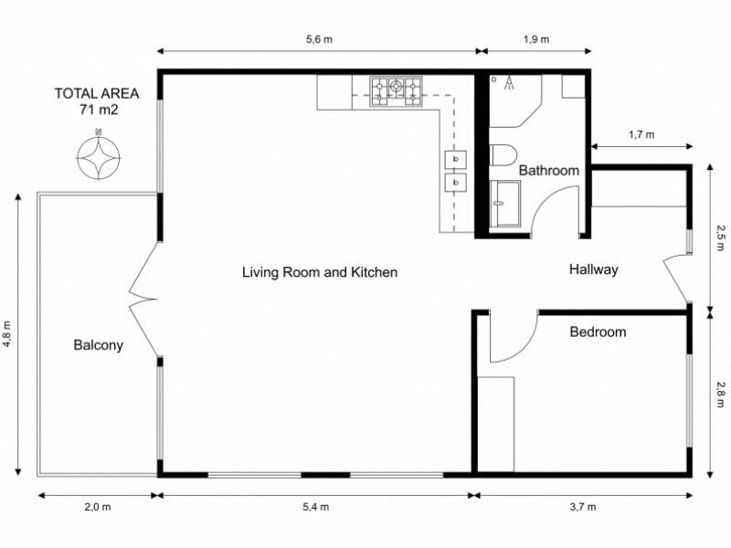

# Absolute vs Relative Path

One of the things people sometimes find hard when starting out with the command line or console is understanding where they are, and where other things are in relation to them.

You'll often see the words "absolute path" and "relative path" used which only adds to that confusion.

Let's see if wee can clear that up by using a house as an example. Here's the floor plan:



As you can see, we have our front door that leads to a Hallway. From the Hallway you can got to the Bedroom, the Bathroom, or the Living Room and Kitchen. You can *only* get to the Balcony from the Living Room and Kitchen.

> If you want to follow along with the commands in your command prompt, follow the instruction [here](#creating-the-folders).

## The front door

The front door is how you enter the house, If anyone wants to enter your house, they need access to the front door.

> The front door is your *root*. It is the base from which all other things inside your house can be accessed.

In Windows-based systems your "root" will be most often your hard drive, and is normally identified by `C:\`, also just known as "the C drive".

We can get to the root by using the command `cd \`.

> **OUR ABSOLUTE LOCATION**
>
> C:\

## The Hallway

From the front door, we move into the Hallway.

So if the front door is our *root* and we move into the Hallway, we can say we navigated to the hallway using the command:

```cd hallway```

> OUR ABSOLUTE LOCATION
>
> C:\Hallway

How do we know where we can go from here? Well, we could look around to see what's available.

To do that we use the `dir` command. This will tell us that rooms we can see are:

```
Directory of C:\Hallway:

DIR Bathroom
DIR Bedroom
DIR Living Room and Kitchen
```

```DIR``` means it's a "room" we can move to.

We can only "see" those 3 rooms. We cannot see the Balcony. That's because the Balcony can *only* be seen when you are in the Living Room and Kitchen.

Let's move into the Living Room and Kitchen.

## Living Room and Kitchen

Right, let's move:

```cd "living room and kitchen"```

> **OUR ABSOLUTE LOCATION**
>
> C:\Hallway\Living Room and Kitchen

Now when we look round, we can see the Balcony using `dir`:

```
Directory of C:\Hallway\Living Room and Kitchen:

DIR Balcony
```

So we can no longer see the Bathroom or the Bedroom.

Wait! Why can't we "see" the Hallway? Good question - and the answer is that *relative* to us, it's behind us.

So it's not a *new* room we can suddenly see from here, it's somewhere we have already been.

## Giving directions

Ok, so we're in the Living Room and Kitchen.

To us the Balcony is only one step away - we can move to the Balcony in one step using `cd Balcony`.

But we can only do that because it's *relative* to where *we* are.

If you had to give directions to someone visiting you might says *"Go through the front door, into the Hallway, through the Living room and Kitchen, and then out to the Balcony"*.

That is an *absolute* - it takes us from the entry point and tells us the exact *path* to take.

## Moving back to the Hallway

Let's move back to the Hallway by going down 2 levels:

```cd ..\..```

Now we are back in Hallway, the the path for us to the Balcony is different again to that of a person who is outside.

Our route to the Balcony is:

```
Living Room and Kitchen -> Balcony
```

Now, we couldn't just tell that to our visitor. They'd get lost - even if our hose is very small!

For someone visiting we would want to tell them the route they need to take to meet us on the balcony is:

```
front door -> Hallway -> Living Room and Kitchen -> Balcony
```

This is because our *relative* starting points are different. Relative paths assume you are already at a known starting point.

This means that *relative* to us, the path to get to the Balcony is:

```cd "living room and kitchen\balcony"```

Whilst a visitor needs the *absolute* path:

```cd "c:\hallway\living room and kitchen\balcony"```

---

When we are working on the command line, you will often need to navigate to another folder or file. Rather than moving into each room one by one (eg `cd hallway`, `cd "living room and kitchen"`, `cd balcony`) we can use the absolute path instead:

```cd "c:\hallway\living room and kitchen\balcony"```

> Why do we sometimes have to use quotes round directory names? Well, if the directory or folder name contains spaces then we need to add quotes so the `cd` command knows it's just one name.

---

# Notes

Here's the directory structure of the floor plan:

```
C:
-|Hallway
    |-Bathroom
    |-Bedroom
    |-Living Room and Kitchen
        |-Balcony
```

## Creating the folders

If you want to create this folder structure to play with our your command line, run the following commands in your command prompt:

```
cd \
md hallway
cd hallway
md bathroom
md bedroom
md "living room and kitchen"
cd "living room and kitchen"
md balcony
cd \
```

After you are done, to remove the directories run the following:

```
cd \
rd /s hallway
```


