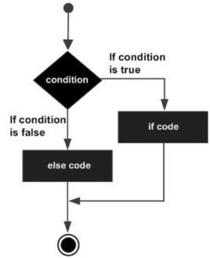

# Batch Files

Now the command line is fine, but typing in commands is repetitive, especially if you need to do them again and again. This is where batch files come in. They can hold multiple commands in a single file to be executed together – essentially a small executable program.

## Batch file basics

End with the `.bat` or `.cmd` extension

Eg `dothing.bat`

Are executed by typing the name of the file (with or without extension) into the command line and hitting Enter

## Task

Create a new folder called `batch`

Create a file in it called `hello.bat`

Open the file in VS Code for editing

 

## My First Batch File

Now we have our file open in VS Code, let's change what's in it so it does something:

 

`@echo OFF` is used to not display `echo` in the output. 

If you remove it, line 2 will display to the console as “echo Hello World” rather than just “Hello World”

Back on the *command line* we can now execute that file by typing `hello` and pressing enter.

Now go find that file in Windows explorer and double click it to execute. 

What do you see?

You should see a window flick up and then immediately close.

That’s because by default these batch files are self-exiting. To make it so we can see the output of we double click, we have to add a `pause` command.

## Pause

 

Update your batch file to add Pause on line 3.

Double click again, what do you see now?

---

 


Hopefully you see something like this! Press any key and the window will close.

---

## Simple Commands In a Batch File

Read this, tell me what it’s going to do?


We can use all commands available to the command line in batch files to automate boring, repetitive tasks!

There’s a problem with the script….can you tell what it is? 

> (line 16 should be `rd` rather than `del`)


# Conditional logic

## Accepting user input

 

To accept user input, we use the `set /p` command. `/p` is shorthand saying “*take the input from the command line prompt*”

And now we need to store that user input somehow. And to store it, we use something called a variable. In our command, we have created a variable called `foldername`, which will store whatever is typed in by the user in response to our question.

If you are not sure what a variable is, you can find read the [variables section](/variables.md).

## Using user input

Okay, so we can assign to a variable, but what's the use? Let's assume we want to create a new folder based on what the user wants.

 

The `%` symbol is how we access the variable. So whilst we have a variable called `foldername`, when we want to use it we have to wrap it in `%`:

```
md %foldername%
```

## New batch file

 


Create a new batch file in the batch folder called `fldr.bat` and add the above code.

Now run it from the command line and check that it creates the folder name you provide it.


> Remember: you can run a `.bat` file just by using the name which will be `fldr`.

# Conditional Logic

We can used conditional logic to decide what code to execute. You do this every day - *"if the kettle has no water, then fill it up and turn it on, otherwise just turn it on"*.

When written as code, this is most often expressed as:

```
IF (condition) 
    (do_something) 
ELSE 
    (do_something_else)
```

The general working of this statement is that first a condition is evaluated in the ‘if’ statement. If the condition is true, it then executes the statements thereafter and stops before the else condition and exits out of the loop. If the condition is false, it then executes the statements in the else statement block and then exits the loop. 

For example:

```
IF 5 > 3 
    (echo 5 is bigger than 3) 
ELSE 
    (echo 5 is smaller than 3!)
```

Which line will be printed out with the above code?

---

The following diagram shows the flow of the ‘if’ statement.



---

## User Input & Conditional Logic

You can, of course, use conditional logic on user input: 

 

Question: What input would we need to enter to execute both parts of the logic?

https://www.tutorialspoint.com/batch_script/batch_script_decision_making.htm

### Operators

| Operators | Description | Example |
| :-: | :-: | :-: |
| EQU | equal to | EQU Return true if x is equal to y |
| NEQ | not equal to | NEQ Returns true if x is not equal to y |
| LSS | less than | LSS Returns true if x is less than y |
| LEQ | less than or equal to | LEQ Returns true if x is less than or equal to y |
| GTR | greater than | GTR Returns true if x is greater than y |
| GEQ | greater than or equal to | GEQ Returns true if x is greater than or equal to y |


# Workshop

 

## Task Recreate the logic

 

https://www.tutorialspoint.com/batch_script/batch_script_if_else_statement.htm

---

# Batch File For Loop

Not sure what loops are, or iterating over a collection? Check out [iteration chapter](/iteration.md).

 

Here's the code for our loop:

```
@echo OFF 
FOR %%x IN (1 2 3) DO ECHO %%x 
PAUSE
```

For loops are very good in batch file programming for doing things like iterating over all the files or folders, which has a slightly different syntax:

> For reasons lost to time, you can only have a one-letter variable name in the below examples!

```
#Print out all files in the C:\Users\dan.webb directory

for /f %%f in ('dir /b "c:\users\dan.webb"') do echo %%f

#Print out all folders in the current directory
for /d %%y in (*.*) do @ECHO %%y

```


