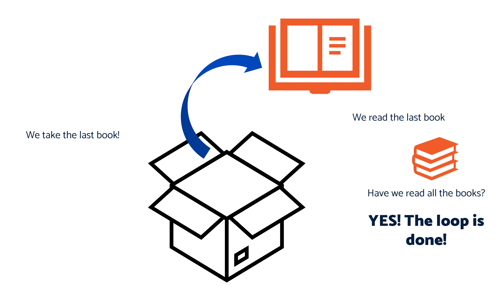

# Iteration - Doing the same thing again and again

## For Loops

Whilst there are *for* loops, often you will hear people say they want to *iterate over a collection*. 

Now what they hell does that mean? Let’s have a look.

## We Iterate Over Collections
Before we can iterate over things, we need to have a set of concepts explained. 

Conceptually, a collection of things can be anything. Games, Books, numbers, strings – when there is more than one thing, we call that a collection. 

Imagine a box full of books. 

The box is the *collection*, whilst each book is an *item*. Remember variables and buckets? And buckets could hold just one thing? Well here we use a box, and the box can contain more than one thing.


* A collection is the fancy name for *one or more* things.
* A collection contains items.
* An item can be anything.
  * This is a type of *abstraction*. It allows us to talk about things without being exact.

## Iterating

Conceptually, we want to operate on each book in our box one at a time.

Think of it as being able to take each book out of the box one by one, and do something with it, like read the title. We are performing the same set of actions again and again.

In pseudocode (*that is, the code you are about to see is not a real programming language and won't run, it's just explaining in a natural English language style*) we iterate over a collection like so:

```
for each item in the collection 
    do something with the item
    and then move to the next item
```

## What is a loop?

Just like the name implies, loops are things that repeat. 

They go round and round and round and round again. Loops don't go on infinitely, though. Instead, they stop when they're told, they reach a particular conclusion, or they repeat a pre-set number of times.

Loops are how you can iterate.

> :thought_balloon: You *iterate* over a *collection* using a *loop*

## Lets iterate!




## Why?

Well, without a loop, we'd have to repeat the same instruction again and again and again, and copy lots of boring code:

```
print “Pride and Prejudice”
print “Wind in the Willows”
print “The Colour of Magic”
print “Coding for Dummies”
print “Enterprise Agile”
```

And if we wanted to do something more than print, we'd have to write that command out for every book too:

```
print “Pride and Prejudice”
read “Pride and Prejudice”

print “Wind in the Willows”
read “Wind in the Willows”

print “The Colour of Magic”
read “The Colour of Magic”

...and so on
```

with a loop, we can make sure we only have to write the important instructions once (the `print` and `read` commands):

```
books = [“Pride and Prejudice”, “Wind in the Willows”, “The Colour of Magic”, “Coding for Dummies”, “Enterprise Agile”]

for each book in books 
    ( 
        print book 
        read book
    )

```

> The `books` variable here is an *array*, a type of collection. If you like, an array is a type of box we can put things in.

Now it doesn't matter *how many* books we have, each one will get printed and read.

We can even add or remove books!

---


---

If you're still a bit confused then [this video](https://www.youtube.com/watch?v=oWjiJIoG3nQ&t=132s) has helped people!