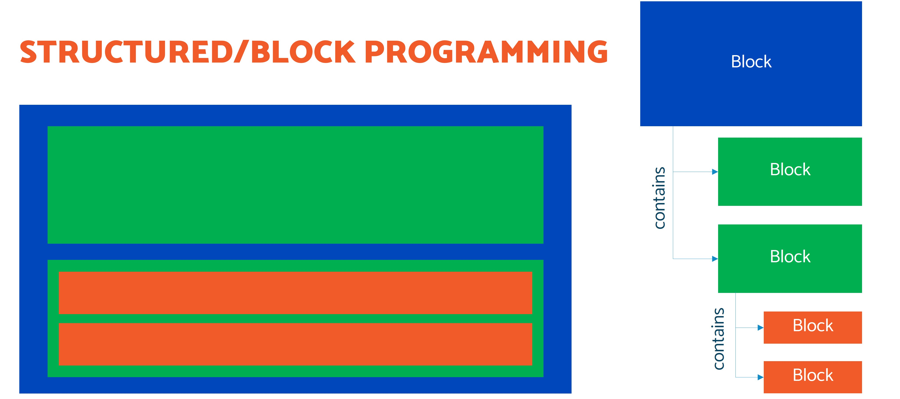
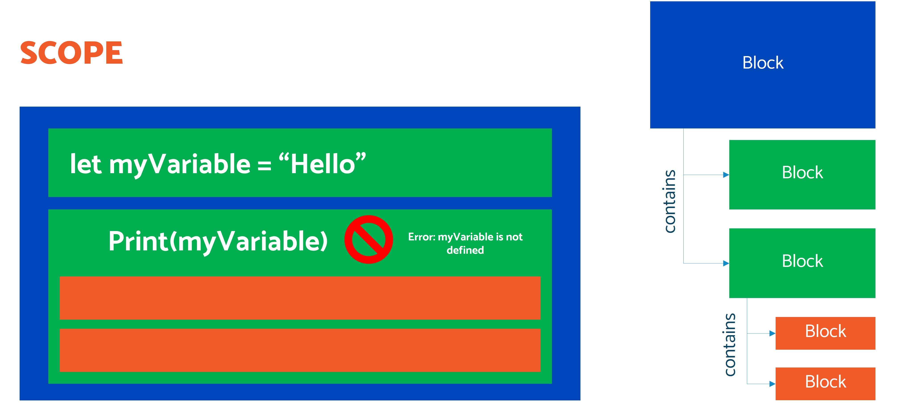
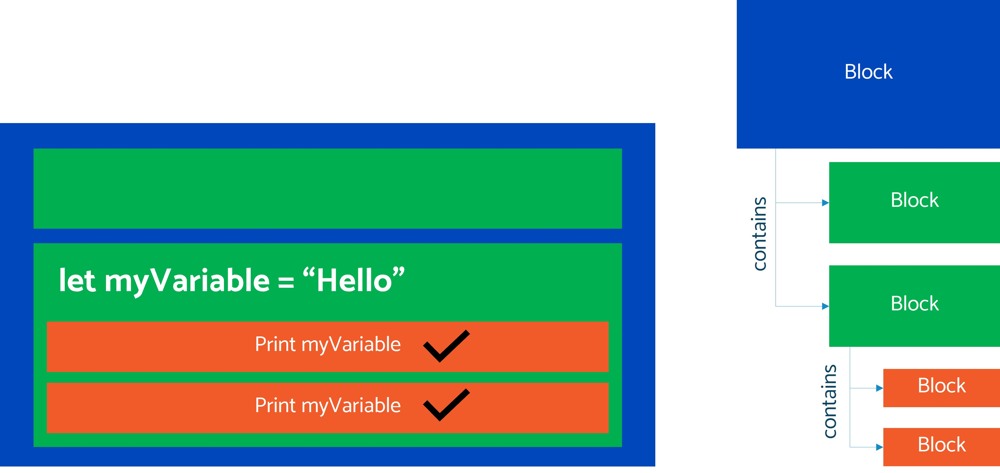

# Scope

When learning to program, sometimes you need to understand *scope* - or where a variable can be accessed from and used.

At the moment, we're learning more about block or structured programming. In computer programming, a block or *code block* or *block of code* is a lexical structure of source code which is grouped together. 

Blocks consist of one or more declarations and statements.

You can see, it's a bit like a tree structure of of directories and files on our computer. 

Now, looking at scope, the two green blocks are separate blocks. That means the variable declared in the first green block *is not accessible* within the second green block. These are siblings and therefore cannot share variables:

However, variables declared in a block *are* available to their children:

