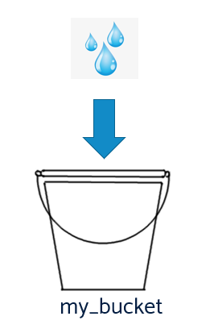

# Variables

Variables allow you to store information that can be accessed over and over again. These are similar to variables in algebra. But in programming, we name our variables according to the syntax of that language. 

Naming a variable is called *declaring a variable*.

In English for example, we might say

Here the equals sign `=` is the *assignment* operator. It lets us know that we have assigned the string `Amanda` to the variable, `name`.

### Variables are like buckets

The bucket now contains sand.

I don’t need to know what is in the bucket, I can just ask “what’s in the bucket named `my_bucket`?”

When I ask what is in the bucket, I will be told that it is sand.

If I add water to the bucket, *it first empties the bucket automagically*.

Variables are *mutable*. Which is a posh way of saying "they can be changed".

Now when I ask “what’s in the bucket named `my_bucket`?”

I will be told it contains water.